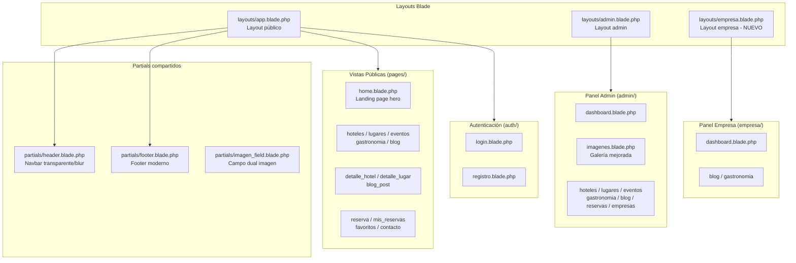
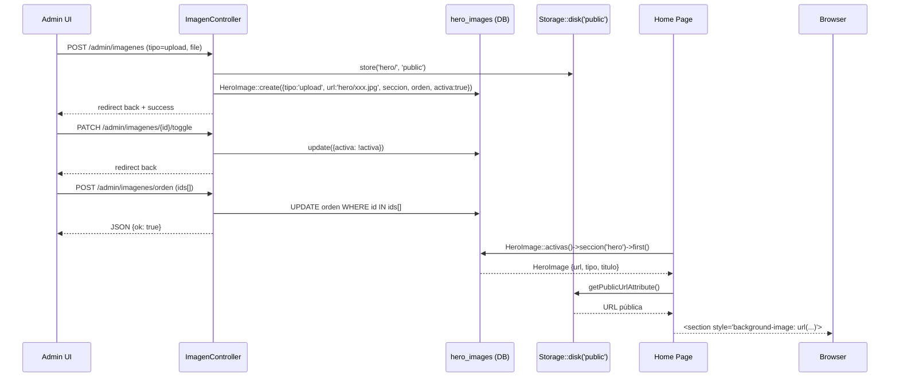

# Documento de Diseño: modern-travel-ui-redesign

## Resumen

Rediseño visual completo de la plataforma de turismo FlowZone (Ortega, Tolima) usando Laravel Blade + CSS puro.
El objetivo es transformar la interfaz actual en una landing page moderna estilo travel/nature con paleta verde natural,
glassmorphism, efectos hover, hero sections impactantes y consistencia total entre vistas públicas, admin y empresa.

El proyecto ya cuenta con modelos, controladores y rutas funcionales. Este rediseño es puramente de capa de presentación:
CSS, layouts Blade, partials y la vista del panel de imágenes del admin.

---

## Arquitectura de Vistas





---

## Sistema de Diseño (Design Tokens)

### Paleta de colores

```css
:root {
  /* Verdes naturales — paleta principal */
  --green-900: #1b4332;   /* texto oscuro, fondos profundos */
  --green-800: #2d6a4f;   /* primary — botones, acentos */
  --green-700: #40916c;   /* secondary — hover states */
  --green-600: #52b788;   /* tertiary — badges, labels */
  --green-400: #74c69d;   /* light accent */
  --green-200: #b7e4c7;   /* tints, borders suaves */
  --green-50:  #d8f3dc;   /* fondos muy suaves */

  /* Dorado/tierra — acento cálido */
  --gold-500:  #d4a017;   /* accent principal */
  --gold-400:  #e8b84b;   /* hover accent */

  /* Neutros */
  --white:     #ffffff;
  --gray-50:   #f8faf9;   /* fondo página */
  --gray-100:  #f0f4f1;
  --gray-200:  #e2e8e4;
  --gray-400:  #9ab0a0;
  --gray-600:  #5a7060;
  --gray-900:  #1a2e22;   /* texto principal */

  /* Semánticos */
  --danger:    #dc2626;
  --warning:   #d97706;
  --success:   #16a34a;
  --info:      #0891b2;

  /* Alias para compatibilidad con código existente */
  --primary:   var(--green-800);
  --secondary: var(--green-700);
  --accent:    var(--gold-500);
  --dark:      var(--gray-900);
  --light:     var(--gray-50);
}
```

### Tipografía

```css
/* Fuentes */
--font-display: 'Playfair Display', Georgia, serif;   /* títulos hero */
--font-body:    'Inter', system-ui, sans-serif;        /* cuerpo */

/* Escala tipográfica */
--text-xs:   0.75rem;    /* 12px */
--text-sm:   0.875rem;   /* 14px */
--text-base: 1rem;       /* 16px */
--text-lg:   1.125rem;   /* 18px */
--text-xl:   1.25rem;    /* 20px */
--text-2xl:  1.5rem;     /* 24px */
--text-3xl:  1.875rem;   /* 30px */
--text-4xl:  2.25rem;    /* 36px */
--text-5xl:  3rem;       /* 48px */
--text-hero: clamp(2.5rem, 6vw, 5rem);  /* hero responsive */
```

### Espaciado y radios

```css
--radius-sm:  6px;
--radius-md:  12px;
--radius-lg:  20px;
--radius-xl:  32px;
--radius-full: 9999px;

--shadow-sm:  0 1px 3px rgba(0,0,0,.08);
--shadow-md:  0 4px 16px rgba(0,0,0,.10);
--shadow-lg:  0 8px 32px rgba(0,0,0,.14);
--shadow-xl:  0 20px 60px rgba(0,0,0,.18);
--shadow-card: 0 4px 20px rgba(45,106,79,.12);
```


---

## Componentes Principales

### 1. Navbar (`partials/header.blade.php`)

**Comportamiento**: Transparente sobre el hero, se vuelve sólida con blur al hacer scroll.

```
Estado inicial (sobre hero):
  background: transparent
  color: white
  position: fixed, z-index: 1000

Estado scroll (>80px):
  background: rgba(27, 67, 50, 0.92)
  backdrop-filter: blur(16px)
  box-shadow: 0 2px 20px rgba(0,0,0,.15)
```

**Estructura HTML**:
```html
<nav class="navbar" id="navbar">
  <div class="container navbar-inner">
    <a class="nav-brand" href="/">
      <i></i> FlowZone
    </a>
    <ul class="nav-menu">
      <li><a href="/lugares">Lugares</a></li>
      <li><a href="/hoteles">Hoteles</a></li>
      <li><a href="/eventos">Eventos</a></li>
      <li><a href="/gastronomia">Gastronomía</a></li>
      <li><a href="/blog">Blog</a></li>
    </ul>
    <div class="nav-actions">
      <!-- auth buttons / user menu -->
    </div>
    <button class="nav-hamburger" id="navToggle">
      <span></span><span></span><span></span>
    </button>
  </div>
</nav>
```

---

### 2. Hero Section (`pages/home.blade.php`)

**Estructura de capas**:
```
[imagen de fondo — cover]
  └── [overlay degradado: rgba(27,67,50,.65) → rgba(64,145,108,.35)]
        └── [contenido: eyebrow + h1 + párrafo + search bar + badges]
              └── [hero-float-cards — posición absoluta inferior]
                    └── [scroll indicator animado]
```

**Dimensiones**: `min-height: 100vh`, padding-top igual a altura del navbar.

**Search bar integrada**:
```html
<form class="hero-search">
  <input type="text" placeholder="¿Qué quieres explorar?">
  <select><!-- categorías --></select>
  <button class="btn btn-primary">Buscar</button>
</form>
```
Estilo: `background: rgba(255,255,255,.15)`, `backdrop-filter: blur(10px)`, border redondeado.

---

### 3. Cards de Contenido

**Variantes**:
- `.card` — card estándar (lugares, hoteles, eventos)
- `.blog-card` — card horizontal para blog
- `.experience-card` — card con overlay completo (sección experiencias)
- `.stat-card` — card de estadísticas en admin

**Estructura `.card`**:
```html
<div class="card">
  <div class="card-img-wrap">
    
    <span class="card-badge">Categoría</span>
    <!-- overlay en hover -->
    <div class="card-img-overlay"></div>
  </div>
  <div class="card-content">
    <h3>Nombre</h3>
    <p class="card-meta">...</p>
    <p class="card-desc">...</p>
    <div class="card-actions">
      <a class="btn btn-outline">Detalles</a>
      <a class="btn btn-primary">Reservar</a>
    </div>
  </div>
</div>
```

**Hover effect**:
```css
.card:hover {
  transform: translateY(-6px);
  box-shadow: var(--shadow-xl);
}
.card:hover .card-img-overlay {
  opacity: 1;  /* overlay verde semitransparente */
}
.card:hover img {
  transform: scale(1.05);
}
```

---

### 4. Botones

```css
/* Variantes */
.btn-primary   → background: var(--green-800), hover: var(--green-700) + translateY(-2px)
.btn-secondary → background: var(--gold-500), hover: var(--gold-400)
.btn-outline   → border: 2px solid var(--green-800), hover: fill verde
.btn-white     → background: white, color: var(--green-800)
.btn-glass     → background: rgba(255,255,255,.15), backdrop-filter: blur(8px), color: white
.btn-danger    → background: var(--danger)

/* Todos los botones */
border-radius: var(--radius-full)  /* pill shape */
transition: all 0.25s ease
font-weight: 600
```

---

### 5. Sidebar Admin

**Estructura**:
```
.admin-sidebar (260px, sticky, height: 100vh)
  ├── .admin-brand (logo + nombre + rol)
  ├── .admin-nav
  │     ├── .nav-section-label (PRINCIPAL, GESTIÓN, CONTENIDO)
  │     └── a.nav-link (icono + texto + badge opcional)
  └── .sidebar-footer (ver sitio + logout)
```

**Colores**:
```css
background: linear-gradient(180deg, #1a2e22 0%, #0f1f16 100%);
/* Links activos */
border-left: 3px solid var(--green-600);
background: rgba(82,183,136,.12);
color: white;
```

---

### 6. Panel de Imágenes Admin (`admin/imagenes.blade.php`)

**Funcionalidades existentes** (ya implementadas en `ImagenController`):
- Subir por archivo o URL
- Secciones: `hero`, `destacadas`, `cards`
- Toggle activa/inactiva
- Reordenar por drag & drop
- Eliminar

**Mejoras de UI a diseñar**:
- Preview del hero en tiempo real (ya existe, mejorar estilos)
- Galería tipo masonry/grid con thumbnails grandes
- Indicador visual de estado activo/inactivo sobre la imagen
- Drag handle visible
- Mini-preview de cómo se ve en el home (sección hero)


---

## Estructura de Layouts

### `layouts/app.blade.php` (público)

```html
<!DOCTYPE html>
<html lang="es">
<head>
  <!-- meta, title, CSS: style.css + FontAwesome + Google Fonts (Inter + Playfair Display) -->
  @stack('head')
</head>
<body class="@yield('body-class')">
  @include('partials.header')   <!-- navbar transparente/blur -->
  @yield('content')             <!-- sin <main> wrapper — cada página lo define -->
  @include('partials.footer')
  <script src="{{ asset('js/script.js') }}"></script>
  @stack('scripts')
</body>
</html>
```

**Nota**: Las páginas que tienen hero full-screen (home, detalle) NO deben tener padding-top en el body.
El navbar es `position: fixed`, así que el hero usa `padding-top: var(--navbar-height)` o `min-height: 100vh`.

### `layouts/admin.blade.php` (admin)

```html
<body>
<div class="admin-layout">
  <aside class="admin-sidebar" id="adminSidebar">
    <!-- brand + nav + footer -->
  </aside>
  <div class="admin-wrapper">
    <header class="admin-topbar">
      <!-- hamburger (mobile) + título página + acciones + usuario -->
    </header>
    <main class="admin-main-inner">
      <!-- alerts session -->
      @yield('content')
    </main>
  </div>
</div>
</body>
```

### `layouts/empresa.blade.php` (empresa — nuevo layout)

Mismo patrón que admin pero con sidebar más simple:
- Solo: Dashboard, Blog, Gastronomía
- Color de acento: `--green-600` en lugar de `--green-800`
- Badge de rol: "Panel Empresa"

---

## Flujo de Datos — Imágenes Hero



---

## Low-Level Design: CSS Específico

### Variables CSS completas (`public/css/style.css` — sección `:root`)

```css
:root {
  /* Colores */
  --green-900: #1b4332;
  --green-800: #2d6a4f;
  --green-700: #40916c;
  --green-600: #52b788;
  --green-400: #74c69d;
  --green-200: #b7e4c7;
  --green-50:  #d8f3dc;
  --gold-500:  #d4a017;
  --gold-400:  #e8b84b;
  --white:     #ffffff;
  --gray-50:   #f8faf9;
  --gray-100:  #f0f4f1;
  --gray-200:  #e2e8e4;
  --gray-400:  #9ab0a0;
  --gray-600:  #5a7060;
  --gray-900:  #1a2e22;
  --danger:    #dc2626;
  --warning:   #d97706;
  --success:   #16a34a;

  /* Alias legacy */
  --primary:   var(--green-800);
  --secondary: var(--green-700);
  --accent:    var(--gold-500);
  --dark:      var(--gray-900);
  --light:     var(--gray-50);
  --gray:      var(--gray-400);

  /* Tipografía */
  --font-display: 'Playfair Display', Georgia, serif;
  --font-body:    'Inter', system-ui, sans-serif;

  /* Espaciado */
  --navbar-height: 72px;
  --radius-sm:  6px;
  --radius-md:  12px;
  --radius-lg:  20px;
  --radius-xl:  32px;
  --radius-full: 9999px;

  /* Sombras */
  --shadow-sm:   0 1px 3px rgba(0,0,0,.08);
  --shadow-md:   0 4px 16px rgba(0,0,0,.10);
  --shadow-lg:   0 8px 32px rgba(0,0,0,.14);
  --shadow-xl:   0 20px 60px rgba(0,0,0,.18);
  --shadow-card: 0 4px 20px rgba(45,106,79,.12);

  /* Transiciones */
  --transition: all 0.25s ease;
  --transition-slow: all 0.4s ease;
}
```


### Navbar CSS

```css
.navbar {
  position: fixed;
  top: 0; left: 0; right: 0;
  z-index: 1000;
  padding: 0 2rem;
  height: var(--navbar-height);
  display: flex;
  align-items: center;
  background: transparent;
  transition: background 0.35s ease, box-shadow 0.35s ease, backdrop-filter 0.35s ease;
}

.navbar.scrolled {
  background: rgba(27, 67, 50, 0.92);
  backdrop-filter: blur(16px);
  -webkit-backdrop-filter: blur(16px);
  box-shadow: 0 2px 20px rgba(0,0,0,.15);
}

/* En páginas sin hero (no-hero class en body) */
body.no-hero .navbar {
  background: var(--green-900);
  box-shadow: var(--shadow-md);
}

.navbar-inner {
  width: 100%;
  max-width: 1280px;
  margin: 0 auto;
  display: flex;
  align-items: center;
  justify-content: space-between;
  gap: 2rem;
}

.nav-brand {
  font-family: var(--font-display);
  font-size: 1.5rem;
  font-weight: 700;
  color: var(--white);
  text-decoration: none;
  display: flex;
  align-items: center;
  gap: .5rem;
  white-space: nowrap;
}

.nav-menu {
  display: flex;
  list-style: none;
  gap: .25rem;
  align-items: center;
}

.nav-menu a {
  color: rgba(255,255,255,.85);
  text-decoration: none;
  font-size: .9rem;
  font-weight: 500;
  padding: .5rem .85rem;
  border-radius: var(--radius-full);
  transition: var(--transition);
}

.nav-menu a:hover,
.nav-menu a.active {
  color: var(--white);
  background: rgba(255,255,255,.12);
}

/* Hamburger mobile */
.nav-hamburger {
  display: none;
  flex-direction: column;
  gap: 5px;
  background: none;
  border: none;
  cursor: pointer;
  padding: .5rem;
}
.nav-hamburger span {
  display: block;
  width: 24px;
  height: 2px;
  background: var(--white);
  border-radius: 2px;
  transition: var(--transition);
}

@media (max-width: 768px) {
  .nav-menu { display: none; }
  .nav-menu.open {
    display: flex;
    flex-direction: column;
    position: absolute;
    top: var(--navbar-height);
    left: 0; right: 0;
    background: rgba(27,67,50,.97);
    backdrop-filter: blur(16px);
    padding: 1rem;
    gap: .25rem;
  }
  .nav-hamburger { display: flex; }
}
```

### Hero CSS

```css
.hero {
  position: relative;
  min-height: 100vh;
  display: flex;
  align-items: center;
  background-size: cover;
  background-position: center;
  background-attachment: fixed;  /* parallax suave */
  overflow: hidden;
}

.hero-overlay {
  position: absolute;
  inset: 0;
  background: linear-gradient(
    160deg,
    rgba(27, 67, 50, 0.78) 0%,
    rgba(64, 145, 108, 0.45) 60%,
    rgba(27, 67, 50, 0.65) 100%
  );
}

.hero-content {
  position: relative;
  z-index: 2;
  max-width: 700px;
  padding-top: var(--navbar-height);
}

.hero-eyebrow {
  display: inline-flex;
  align-items: center;
  gap: .5rem;
  background: rgba(255,255,255,.12);
  backdrop-filter: blur(8px);
  border: 1px solid rgba(255,255,255,.2);
  color: var(--green-200);
  font-size: .8rem;
  font-weight: 600;
  letter-spacing: .08em;
  text-transform: uppercase;
  padding: .4rem 1rem;
  border-radius: var(--radius-full);
  margin-bottom: 1.5rem;
}

.hero h1 {
  font-family: var(--font-display);
  font-size: var(--text-hero);
  font-weight: 900;
  color: var(--white);
  line-height: 1.05;
  letter-spacing: -.02em;
  margin-bottom: 1.25rem;
}

.hero h1 span {
  /* acento dorado en la palabra clave */
  background: linear-gradient(135deg, var(--gold-400), var(--gold-500));
  -webkit-background-clip: text;
  -webkit-text-fill-color: transparent;
  background-clip: text;
}

.hero p {
  font-size: 1.15rem;
  color: rgba(255,255,255,.8);
  max-width: 520px;
  line-height: 1.7;
  margin-bottom: 2rem;
}

/* Search bar glassmorphism */
.hero-search {
  display: flex;
  gap: .5rem;
  background: rgba(255,255,255,.12);
  backdrop-filter: blur(12px);
  border: 1px solid rgba(255,255,255,.2);
  border-radius: var(--radius-xl);
  padding: .5rem;
  margin-bottom: 1.5rem;
  flex-wrap: wrap;
}

.hero-search input,
.hero-search select {
  background: transparent;
  border: none;
  outline: none;
  color: var(--white);
  font-size: .95rem;
  padding: .6rem 1rem;
  flex: 1;
  min-width: 140px;
}

.hero-search input::placeholder { color: rgba(255,255,255,.6); }
.hero-search select option { background: var(--green-900); color: var(--white); }

/* Badges hero */
.hero-badges {
  display: flex;
  gap: .75rem;
  flex-wrap: wrap;
}

.hero-badge {
  display: inline-flex;
  align-items: center;
  gap: .4rem;
  background: rgba(255,255,255,.1);
  border: 1px solid rgba(255,255,255,.15);
  color: rgba(255,255,255,.85);
  font-size: .8rem;
  padding: .35rem .85rem;
  border-radius: var(--radius-full);
  backdrop-filter: blur(6px);
}

/* Float cards */
.hero-float-cards {
  position: absolute;
  bottom: 2.5rem;
  right: 2rem;
  display: flex;
  flex-direction: column;
  gap: .75rem;
  z-index: 2;
}

.hero-float-card {
  display: flex;
  align-items: center;
  gap: .75rem;
  background: rgba(255,255,255,.12);
  backdrop-filter: blur(12px);
  border: 1px solid rgba(255,255,255,.18);
  border-radius: var(--radius-lg);
  padding: .75rem 1.25rem;
  color: var(--white);
  font-size: .85rem;
  font-weight: 500;
  min-width: 180px;
}

.hero-float-card i {
  font-size: 1.2rem;
  color: var(--green-400);
}

/* Scroll indicator */
.hero-scroll {
  position: absolute;
  bottom: 2rem;
  left: 50%;
  transform: translateX(-50%);
  display: flex;
  flex-direction: column;
  align-items: center;
  gap: .4rem;
  color: rgba(255,255,255,.6);
  font-size: .75rem;
  letter-spacing: .1em;
  text-transform: uppercase;
  animation: bounce 2s ease-in-out infinite;
  z-index: 2;
}

@keyframes bounce {
  0%, 100% { transform: translateX(-50%) translateY(0); }
  50%       { transform: translateX(-50%) translateY(6px); }
}
```


### Cards CSS

```css
/* Wrapper de imagen con overflow hidden para el zoom */
.card-img-wrap {
  position: relative;
  overflow: hidden;
  height: 220px;
}

.card-img-wrap img {
  width: 100%;
  height: 100%;
  object-fit: cover;
  transition: transform 0.5s ease;
}

.card:hover .card-img-wrap img {
  transform: scale(1.07);
}

/* Overlay verde en hover */
.card-img-overlay {
  position: absolute;
  inset: 0;
  background: linear-gradient(
    to top,
    rgba(27,67,50,.6) 0%,
    transparent 60%
  );
  opacity: 0;
  transition: opacity 0.35s ease;
}

.card:hover .card-img-overlay {
  opacity: 1;
}

/* Badge sobre imagen */
.card-badge {
  position: absolute;
  top: .75rem;
  left: .75rem;
  background: var(--green-800);
  color: var(--white);
  font-size: .72rem;
  font-weight: 700;
  letter-spacing: .05em;
  text-transform: uppercase;
  padding: .3rem .75rem;
  border-radius: var(--radius-full);
}

.card-badge-accent {
  background: var(--gold-500);
}

/* Card body */
.card {
  background: var(--white);
  border-radius: var(--radius-lg);
  overflow: hidden;
  box-shadow: var(--shadow-card);
  transition: transform 0.3s ease, box-shadow 0.3s ease;
}

.card:hover {
  transform: translateY(-6px);
  box-shadow: var(--shadow-xl);
}

.card-content {
  padding: 1.4rem;
}

.card-content h3 {
  font-size: 1.05rem;
  font-weight: 700;
  color: var(--gray-900);
  margin-bottom: .4rem;
  line-height: 1.3;
}

.card-meta {
  font-size: .82rem;
  color: var(--gray-400);
  display: flex;
  align-items: center;
  gap: .3rem;
  margin-bottom: .5rem;
}

.card-actions {
  display: flex;
  gap: .5rem;
  margin-top: 1rem;
}
```

### Botones CSS

```css
.btn {
  display: inline-flex;
  align-items: center;
  justify-content: center;
  gap: .4rem;
  padding: .65rem 1.4rem;
  border: 2px solid transparent;
  border-radius: var(--radius-full);
  font-size: .9rem;
  font-weight: 600;
  font-family: var(--font-body);
  cursor: pointer;
  text-decoration: none;
  transition: var(--transition);
  white-space: nowrap;
  line-height: 1;
}

.btn-primary {
  background: var(--green-800);
  color: var(--white);
  border-color: var(--green-800);
}
.btn-primary:hover {
  background: var(--green-700);
  border-color: var(--green-700);
  transform: translateY(-2px);
  box-shadow: 0 6px 20px rgba(45,106,79,.35);
}

.btn-outline {
  background: transparent;
  color: var(--green-800);
  border-color: var(--green-800);
}
.btn-outline:hover {
  background: var(--green-800);
  color: var(--white);
  transform: translateY(-2px);
}

.btn-white {
  background: var(--white);
  color: var(--green-800);
  border-color: var(--white);
}
.btn-white:hover {
  background: var(--green-50);
  transform: translateY(-2px);
  box-shadow: var(--shadow-md);
}

.btn-glass {
  background: rgba(255,255,255,.15);
  color: var(--white);
  border-color: rgba(255,255,255,.3);
  backdrop-filter: blur(8px);
}
.btn-glass:hover {
  background: rgba(255,255,255,.25);
  transform: translateY(-2px);
}

.btn-secondary {
  background: var(--gold-500);
  color: var(--white);
  border-color: var(--gold-500);
}
.btn-secondary:hover {
  background: var(--gold-400);
  border-color: var(--gold-400);
  transform: translateY(-2px);
}

.btn-danger {
  background: var(--danger);
  color: var(--white);
  border-color: var(--danger);
}

/* Tamaños */
.btn-sm { padding: .4rem .9rem; font-size: .8rem; }
.btn-lg { padding: .85rem 2rem; font-size: 1rem; }
.btn-block { width: 100%; }
```

### Secciones y Grid

```css
.section {
  padding: 5rem 0;
}

.section-label {
  display: inline-flex;
  align-items: center;
  gap: .5rem;
  font-size: .78rem;
  font-weight: 700;
  letter-spacing: .12em;
  text-transform: uppercase;
  color: var(--green-700);
  margin-bottom: .75rem;
}

.section-label::before {
  content: '';
  display: block;
  width: 20px;
  height: 2px;
  background: var(--green-600);
  border-radius: 2px;
}

.section-title {
  font-family: var(--font-display);
  font-size: clamp(1.6rem, 3vw, 2.2rem);
  font-weight: 800;
  color: var(--gray-900);
  line-height: 1.2;
  letter-spacing: -.02em;
}

.section-header {
  display: flex;
  align-items: flex-end;
  justify-content: space-between;
  margin-bottom: 2.5rem;
  gap: 1rem;
}

/* Grid de cards */
.grid {
  display: grid;
  grid-template-columns: repeat(auto-fill, minmax(300px, 1fr));
  gap: 1.75rem;
}

/* Grid de blog (2 columnas en desktop) */
.blog-grid {
  display: grid;
  grid-template-columns: repeat(auto-fill, minmax(320px, 1fr));
  gap: 1.75rem;
}

/* Experience grid (asimétrico) */
.experience-grid {
  display: grid;
  grid-template-columns: 1fr 1fr;
  grid-template-rows: 280px 280px;
  gap: 1rem;
}

.experience-card.tall {
  grid-row: span 2;
}

.experience-card {
  position: relative;
  border-radius: var(--radius-lg);
  overflow: hidden;
  cursor: pointer;
}

.experience-card img {
  width: 100%; height: 100%;
  object-fit: cover;
  transition: transform 0.5s ease;
}

.experience-card:hover img {
  transform: scale(1.06);
}

.experience-card-overlay {
  position: absolute;
  inset: 0;
  background: linear-gradient(to top, rgba(27,67,50,.85) 0%, transparent 55%);
  display: flex;
  flex-direction: column;
  justify-content: flex-end;
  padding: 1.5rem;
  color: var(--white);
}

.exp-tag {
  display: inline-block;
  background: var(--green-600);
  color: var(--white);
  font-size: .72rem;
  font-weight: 700;
  letter-spacing: .08em;
  text-transform: uppercase;
  padding: .25rem .7rem;
  border-radius: var(--radius-full);
  margin-bottom: .6rem;
  width: fit-content;
}
```


### Admin Layout CSS

```css
/* Layout principal */
.admin-layout {
  display: flex;
  min-height: 100vh;
  background: var(--gray-50);
}

/* Sidebar */
.admin-sidebar {
  width: 260px;
  background: linear-gradient(180deg, #1a2e22 0%, #0f1f16 100%);
  display: flex;
  flex-direction: column;
  position: sticky;
  top: 0;
  height: 100vh;
  overflow-y: auto;
  flex-shrink: 0;
  transition: transform 0.3s ease;
}

.admin-brand {
  padding: 1.5rem;
  border-bottom: 1px solid rgba(255,255,255,.06);
  margin-bottom: .5rem;
}

.admin-brand-logo {
  display: flex;
  align-items: center;
  gap: .75rem;
  margin-bottom: .25rem;
}

.admin-brand-icon {
  width: 36px; height: 36px;
  background: linear-gradient(135deg, var(--green-700), var(--green-600));
  border-radius: var(--radius-md);
  display: flex;
  align-items: center;
  justify-content: center;
  color: var(--white);
  font-size: 1rem;
}

.admin-brand h2 {
  font-size: 1.1rem;
  font-weight: 700;
  color: var(--white);
}

.admin-brand span {
  font-size: .72rem;
  color: rgba(255,255,255,.35);
  letter-spacing: .05em;
}

/* Nav links */
.nav-section-label {
  padding: .8rem 1.5rem .3rem;
  font-size: .65rem;
  font-weight: 700;
  letter-spacing: .15em;
  text-transform: uppercase;
  color: rgba(255,255,255,.25);
}

.admin-nav a {
  display: flex;
  align-items: center;
  gap: .75rem;
  padding: .7rem 1.5rem;
  color: rgba(255,255,255,.6);
  text-decoration: none;
  font-size: .875rem;
  font-weight: 500;
  border-left: 3px solid transparent;
  transition: var(--transition);
}

.admin-nav a:hover {
  background: rgba(255,255,255,.05);
  color: var(--white);
  border-left-color: var(--green-600);
}

.admin-nav a.active {
  background: rgba(82,183,136,.12);
  color: var(--white);
  border-left-color: var(--green-600);
  font-weight: 600;
}

.admin-nav a i {
  width: 18px;
  text-align: center;
  font-size: .9rem;
  opacity: .8;
}

.admin-notif-badge {
  margin-left: auto;
  background: var(--danger);
  color: var(--white);
  font-size: .65rem;
  font-weight: 700;
  padding: 2px 7px;
  border-radius: var(--radius-full);
  min-width: 18px;
  text-align: center;
}

/* Sidebar logout button */
.sidebar-logout-btn {
  display: flex;
  align-items: center;
  gap: .75rem;
  width: 100%;
  padding: .7rem 1.5rem;
  background: none;
  border: none;
  border-left: 3px solid transparent;
  color: rgba(255,255,255,.5);
  font-size: .875rem;
  font-family: var(--font-body);
  cursor: pointer;
  transition: var(--transition);
  text-align: left;
}

.sidebar-logout-btn:hover {
  background: rgba(220,38,38,.1);
  color: #fca5a5;
  border-left-color: var(--danger);
}

/* Wrapper derecho */
.admin-wrapper {
  flex: 1;
  display: flex;
  flex-direction: column;
  min-width: 0;
}

/* Topbar */
.admin-topbar {
  background: var(--white);
  padding: 1rem 2rem;
  display: flex;
  align-items: center;
  justify-content: space-between;
  border-bottom: 1px solid var(--gray-200);
  position: sticky;
  top: 0;
  z-index: 100;
}

.topbar-title h1 {
  font-size: 1.1rem;
  font-weight: 700;
  color: var(--gray-900);
  line-height: 1.2;
}

.topbar-title p {
  font-size: .78rem;
  color: var(--gray-400);
  margin-top: 1px;
}

/* Main content */
.admin-main-inner {
  flex: 1;
  padding: 2rem;
  overflow-y: auto;
}

/* Stat cards */
.stats-grid {
  display: grid;
  grid-template-columns: repeat(auto-fill, minmax(180px, 1fr));
  gap: 1.25rem;
  margin-bottom: 2rem;
}

.stat-card {
  background: var(--white);
  border-radius: var(--radius-lg);
  padding: 1.4rem;
  display: flex;
  align-items: center;
  gap: 1rem;
  box-shadow: var(--shadow-sm);
  border-left: 4px solid transparent;
  transition: var(--transition);
}

.stat-card:hover {
  transform: translateY(-3px);
  box-shadow: var(--shadow-md);
}

.stat-card.green  { border-left-color: var(--green-700); }
.stat-card.blue   { border-left-color: #3b82f6; }
.stat-card.orange { border-left-color: var(--warning); }
.stat-card.purple { border-left-color: #8b5cf6; }
.stat-card.teal   { border-left-color: #06b6d4; }
.stat-card.red    { border-left-color: var(--danger); }

.stat-icon-wrap {
  width: 44px; height: 44px;
  border-radius: var(--radius-md);
  background: var(--gray-100);
  display: flex;
  align-items: center;
  justify-content: center;
  font-size: 1.2rem;
  color: var(--green-700);
  flex-shrink: 0;
}

.stat-info h3 {
  font-size: 1.6rem;
  font-weight: 800;
  color: var(--gray-900);
  line-height: 1;
}

.stat-info p {
  font-size: .8rem;
  color: var(--gray-400);
  margin-top: 2px;
}

/* Admin section card */
.admin-section {
  background: var(--white);
  border-radius: var(--radius-lg);
  padding: 1.75rem;
  margin-bottom: 1.5rem;
  box-shadow: var(--shadow-sm);
}

/* Admin table */
.admin-table {
  width: 100%;
  border-collapse: collapse;
}

.admin-table th {
  background: var(--gray-50);
  color: var(--gray-600);
  font-size: .75rem;
  font-weight: 700;
  letter-spacing: .08em;
  text-transform: uppercase;
  padding: .85rem 1rem;
  text-align: left;
  border-bottom: 2px solid var(--gray-200);
}

.admin-table td {
  padding: .9rem 1rem;
  border-bottom: 1px solid var(--gray-100);
  font-size: .875rem;
  color: var(--gray-900);
  vertical-align: middle;
}

.admin-table tr:hover td {
  background: var(--gray-50);
}

/* Mobile sidebar */
@media (max-width: 768px) {
  .admin-sidebar {
    position: fixed;
    left: 0; top: 0; bottom: 0;
    z-index: 200;
    transform: translateX(-100%);
  }
  .admin-sidebar.open {
    transform: translateX(0);
  }
  .admin-menu-toggle {
    display: block !important;
  }
  .admin-main-inner {
    padding: 1rem;
  }
}
```

### Footer CSS

```css
.footer {
  background: linear-gradient(180deg, var(--green-900) 0%, #0f1f16 100%);
  color: rgba(255,255,255,.75);
  padding: 4rem 0 1.5rem;
  margin-top: 0;
}

.footer-content {
  display: grid;
  grid-template-columns: 2fr 1fr 1fr 1fr;
  gap: 3rem;
  margin-bottom: 3rem;
}

.footer-brand h3 {
  font-family: var(--font-display);
  font-size: 1.5rem;
  color: var(--white);
  margin-bottom: .75rem;
}

.footer-brand p {
  font-size: .875rem;
  line-height: 1.7;
  color: rgba(255,255,255,.5);
  max-width: 280px;
  margin-bottom: 1.25rem;
}

.footer-social {
  display: flex;
  gap: .75rem;
}

.footer-social a {
  width: 36px; height: 36px;
  background: rgba(255,255,255,.08);
  border: 1px solid rgba(255,255,255,.1);
  border-radius: var(--radius-md);
  display: flex;
  align-items: center;
  justify-content: center;
  color: rgba(255,255,255,.6);
  text-decoration: none;
  font-size: .9rem;
  transition: var(--transition);
}

.footer-social a:hover {
  background: var(--green-700);
  border-color: var(--green-700);
  color: var(--white);
  transform: translateY(-2px);
}

.footer-section h4 {
  font-size: .85rem;
  font-weight: 700;
  letter-spacing: .08em;
  text-transform: uppercase;
  color: var(--white);
  margin-bottom: 1.25rem;
}

.footer-section ul { list-style: none; }

.footer-section li {
  margin-bottom: .6rem;
}

.footer-section a {
  color: rgba(255,255,255,.5);
  text-decoration: none;
  font-size: .875rem;
  display: flex;
  align-items: center;
  gap: .5rem;
  transition: var(--transition);
}

.footer-section a:hover {
  color: var(--green-400);
  padding-left: .25rem;
}

.footer-bottom {
  display: flex;
  align-items: center;
  justify-content: space-between;
  padding-top: 1.5rem;
  border-top: 1px solid rgba(255,255,255,.06);
  font-size: .8rem;
  color: rgba(255,255,255,.3);
  flex-wrap: wrap;
  gap: .5rem;
}

@media (max-width: 768px) {
  .footer-content {
    grid-template-columns: 1fr 1fr;
    gap: 2rem;
  }
  .footer-brand { grid-column: span 2; }
}

@media (max-width: 480px) {
  .footer-content { grid-template-columns: 1fr; }
  .footer-brand { grid-column: span 1; }
}
```


### Animaciones y Efectos

```css
/* Fade-in on scroll */
.animate-on-scroll {
  opacity: 0;
  transform: translateY(28px);
  transition: opacity 0.6s ease, transform 0.6s ease;
}

.animate-on-scroll.visible {
  opacity: 1;
  transform: translateY(0);
}

/* Stagger delay para grids */
.animate-on-scroll:nth-child(2) { transition-delay: 0.1s; }
.animate-on-scroll:nth-child(3) { transition-delay: 0.2s; }
.animate-on-scroll:nth-child(4) { transition-delay: 0.3s; }

/* Fade-in inicial (hero) */
.fade-in {
  animation: fadeInUp 0.9s ease both;
}

@keyframes fadeInUp {
  from { opacity: 0; transform: translateY(30px); }
  to   { opacity: 1; transform: translateY(0); }
}

/* Glassmorphism utility */
.glass {
  background: rgba(255,255,255,.1);
  backdrop-filter: blur(12px);
  -webkit-backdrop-filter: blur(12px);
  border: 1px solid rgba(255,255,255,.15);
}

/* Stats strip */
.stats-strip {
  display: grid;
  grid-template-columns: repeat(4, 1fr);
  background: var(--white);
  border-radius: var(--radius-xl);
  box-shadow: var(--shadow-lg);
  margin: -3rem 0 0;
  position: relative;
  z-index: 10;
  overflow: hidden;
}

.stats-strip-item {
  padding: 1.75rem 1.5rem;
  text-align: center;
  border-right: 1px solid var(--gray-100);
}

.stats-strip-item:last-child { border-right: none; }

.stats-strip-item h3 {
  font-family: var(--font-display);
  font-size: 2rem;
  font-weight: 800;
  color: var(--green-800);
  line-height: 1;
  margin-bottom: .3rem;
}

.stats-strip-item p {
  font-size: .82rem;
  color: var(--gray-400);
  font-weight: 500;
}

@media (max-width: 640px) {
  .stats-strip { grid-template-columns: repeat(2, 1fr); }
  .stats-strip-item:nth-child(2) { border-right: none; }
}
```

### JavaScript — Navbar scroll + Animate on scroll

```javascript
// script.js

// Navbar scroll effect
const navbar = document.getElementById('navbar');
if (navbar) {
  window.addEventListener('scroll', () => {
    navbar.classList.toggle('scrolled', window.scrollY > 80);
  }, { passive: true });
}

// Mobile nav toggle
const navToggle = document.getElementById('navToggle');
const navMenu = document.querySelector('.nav-menu');
if (navToggle && navMenu) {
  navToggle.addEventListener('click', () => {
    navMenu.classList.toggle('open');
    navToggle.classList.toggle('open');
  });
}

// Animate on scroll (IntersectionObserver)
const observer = new IntersectionObserver((entries) => {
  entries.forEach(entry => {
    if (entry.isIntersecting) {
      entry.target.classList.add('visible');
      observer.unobserve(entry.target);
    }
  });
}, { threshold: 0.12, rootMargin: '0px 0px -40px 0px' });

document.querySelectorAll('.animate-on-scroll').forEach(el => observer.observe(el));

// Admin sidebar mobile toggle
const adminToggle = document.getElementById('adminMenuToggle');
const adminSidebar = document.getElementById('adminSidebar');
if (adminToggle && adminSidebar) {
  adminToggle.addEventListener('click', () => adminSidebar.classList.toggle('open'));
  // Cerrar al hacer click fuera
  document.addEventListener('click', (e) => {
    if (!adminSidebar.contains(e.target) && !adminToggle.contains(e.target)) {
      adminSidebar.classList.remove('open');
    }
  });
}
```

---

## Consistencia entre Paneles

| Elemento | Público | Admin | Empresa | Auth |
|---|---|---|---|---|
| Fuente | Inter + Playfair | Inter | Inter | Inter |
| Color primario | `--green-800` | `--green-800` | `--green-700` | `--green-800` |
| Navbar | Transparente/blur | Sidebar oscuro | Sidebar oscuro | Sin navbar |
| Cards | Sombra + hover lift | Tabla + sección card | Tabla + sección card | Auth box |
| Botones | Pill shape | Pill shape | Pill shape | Pill shape |
| Inputs | Border radius md | Border radius md | Border radius md | Border radius md |
| Alertas | Alert con border-left | Alert con border-left | Alert con border-left | Alert con border-left |

---

## Consideraciones de Implementación

### Archivos a modificar

1. `public/css/style.css` — Reemplazar completamente con nuevo sistema de diseño
2. `resources/views/layouts/app.blade.php` — Agregar Playfair Display a Google Fonts
3. `resources/views/layouts/admin.blade.php` — Actualizar estructura `.admin-wrapper`
4. `resources/views/partials/header.blade.php` — Navbar con `id="navbar"` para JS scroll
5. `resources/views/partials/footer.blade.php` — Footer con nuevo grid 4 columnas
6. `resources/views/pages/home.blade.php` — Hero con overlay div separado
7. `resources/views/admin/imagenes.blade.php` — Galería mejorada con thumbnails grandes
8. `public/js/script.js` — Agregar navbar scroll + IntersectionObserver

### Archivos a crear

1. `resources/views/layouts/empresa.blade.php` — Layout empresa (actualmente no existe)

### Compatibilidad con código existente

- Mantener clases legacy: `.btn`, `.btn-primary`, `.btn-secondary`, `.card`, `.grid`, `.section`, `.admin-table`, `.badge-*`, `.estado-*`
- Las variables CSS `--primary`, `--secondary`, `--accent`, `--dark`, `--light`, `--gray` se mantienen como alias
- El modelo `HeroImage` y `ImagenController` no requieren cambios
- Las rutas no cambian

### Dependencias externas a agregar

```html
<!-- Google Fonts — agregar Playfair Display -->
<link href="https://fonts.googleapis.com/css2?family=Inter:wght@300;400;500;600;700;800;900&family=Playfair+Display:wght@700;800;900&display=swap" rel="stylesheet">
```


---

## Propiedades de Corrección

Las siguientes propiedades deben mantenerse verdaderas en toda implementación:

1. **Compatibilidad de variables**: Toda clase CSS que use `var(--primary)`, `var(--accent)`, `var(--dark)` debe seguir funcionando sin cambios en los templates Blade existentes.

2. **Navbar transparente solo en hero**: La clase `.scrolled` se aplica únicamente via JavaScript al hacer scroll. En páginas sin hero (`body.no-hero`), el navbar debe ser sólido desde el inicio.

3. **Imágenes hero desde DB**: El componente hero en `home.blade.php` siempre debe intentar cargar la imagen desde `HeroImage::activas()->seccion('hero')->first()`. Si no existe, debe mostrar un fondo degradado verde como fallback.

4. **Responsive breakpoints**:
   - `>1024px`: Layout completo (sidebar visible, grid 3 columnas)
   - `768px–1024px`: Sidebar colapsado, grid 2 columnas
   - `<768px`: Sidebar oculto (toggle), grid 1 columna, nav hamburger

5. **Accesibilidad mínima**: Todos los botones de icono deben tener `aria-label`. Las imágenes deben tener `alt`. El contraste de texto sobre overlays verdes debe ser ≥ 4.5:1 (WCAG AA).

6. **Performance**: `background-attachment: fixed` (parallax) debe desactivarse en móvil para evitar jank:
   ```css
   @media (max-width: 768px) {
     .hero { background-attachment: scroll; }
   }
   ```
